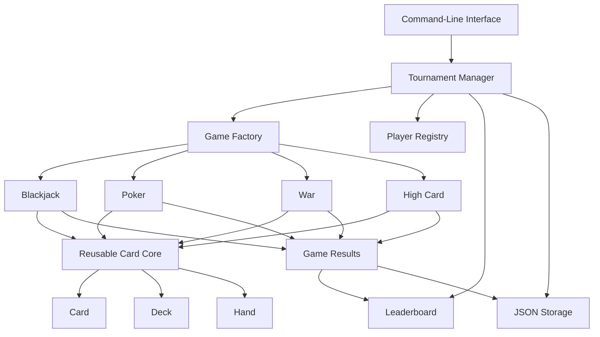

# Phase 1: Programming Foundations Through Projects

This expands Phase 1 of the beginner-to-LLM curriculum into an eight-week project-based program. 

**Duration:** 8 weeks
**Schedule:** 40 hours per week
**Primary language:** Python
**Target:** Build programs independently, test them, debug them, explain their design, and solve entry-level Python interview problems.

Phase 1 alone will not prepare you for advanced software-engineering or machine-learning interviews. It should prepare you for:

* Python fundamentals interviews
* Junior-level coding screens
* Basic debugging exercises
* Object-oriented programming questions
* Project walkthroughs
* Easy array, string, list, dictionary, and set problems

You should complete **15 projects**, but not all projects need to be large. The first five are short projects, the middle five are medium projects, and the final five are portfolio-quality applications.

---

# Phase 1 Learning Structure

## Weekly Time Allocation

| Activity                            |  Daily time |  Weekly time |
| ----------------------------------- | ----------: | -----------: |
| Python lessons and exercises        |     2 hours |     10 hours |
| Coding interview practice           |      1 hour |      5 hours |
| Project development                 |     3 hours |     15 hours |
| Testing and debugging               |      1 hour |      5 hours |
| Git, documentation, and explanation |      1 hour |      5 hours |
| **Total**                           | **8 hours** | **40 hours** |

## The Project-Design Process

Before writing code for every project, create a `DESIGN.md` file containing:

1. Problem statement
2. User stories
3. Functional requirements
4. Inputs and expected outputs
5. Rules and assumptions
6. Data structures
7. Proposed functions
8. Proposed classes
9. Error cases
10. Pseudocode
11. Test plan
12. Future improvements

Do not start coding until you can explain the design verbally.

---

# Week-by-Week Phase 1 Breakdown

## Week 1: Variables, Types, Input, Output, and Conditions

### Learn

* Running Python programs
* Variables and assignment
* Integers, floats, strings, Booleans, and `None`
* Arithmetic and comparison operators
* String formatting
* User input
* `if`, `elif`, and `else`
* Basic validation
* Reading error messages

### Projects

1. Interactive Calculator
2. Personal Budget and Tip Calculator
3. Number-Guessing Tournament

### Interview practice

Solve problems involving:

* Odd versus even
* Maximum of three numbers
* Leap-year validation
* Character classification
* Temperature conversion
* FizzBuzz
* Basic string formatting

### Week 1 exit test

Without notes, build a program that:

* Accepts three numbers
* Rejects invalid input
* Calculates minimum, maximum, sum, and average
* Prints a properly formatted report
* Contains at least five tests

---

## Week 2: Loops, Functions, Lists, and Tuples

### Learn

* `for` and `while` loops
* Loop termination
* `break` and `continue`
* Functions
* Parameters and return values
* Local and global scope
* Lists and tuples
* Indexing and slicing
* List methods
* Nested loops
* Function decomposition

### Projects

4. Quiz and Flashcard Engine
5. Hangman
6. Tic-Tac-Toe

### Interview practice

Solve problems involving:

* Reverse a string
* Find the largest list element
* Remove duplicates without using `set`
* Count vowels
* Calculate a running total
* Find the second-largest value
* Check whether a string is a palindrome
* Rotate a list by one position

### Week 2 exit test

Build Tic-Tac-Toe from a blank file in two hours using:

* At least six functions
* Input validation
* Win detection
* Draw detection
* No global mutable game state

---

## Week 3: Dictionaries, Sets, Files, and Text Processing

### Learn

* Dictionaries and key-value modeling
* Dictionary iteration
* Sets and uniqueness
* Text files
* CSV and JSON
* File paths
* Context managers
* String normalization
* Frequency counting
* Basic search and sorting

### Projects

7. Contact Book
8. Text and Log Analyzer
9. Expense Tracker

### Interview practice

Solve problems involving:

* Character frequency
* Word frequency
* First nonrepeating character
* Two Sum
* Dictionary inversion
* Group words by first letter
* Find common elements
* Detect duplicate records

### Week 3 exit test

Given a text file, produce a report containing:

* Total lines
* Total words
* Unique words
* Ten most common words
* Longest word
* Average word length
* Number of error-related lines

---

## Week 4: Exceptions, Modules, Command-Line Applications, and Git

### Learn

* `try`, `except`, `else`, and `finally`
* Raising exceptions
* Custom exceptions
* Separating code into modules
* `if __name__ == "__main__"`
* Command-line arguments
* `argparse`
* Virtual environments
* Package installation
* `.gitignore`
* Branches, commits, merges, and pull requests

### Projects

10. Command-Line Task Manager
11. Reusable Playing-Card and Deck Library

### Interview practice

* Explain exception flow
* Debug incorrect file paths
* Repair functions that swallow exceptions
* Refactor one large function into modules
* Explain import behavior
* Explain why mutable global state creates problems

### Week 4 exit test

Create a command-line program with commands such as:

```bash
python app.py add "Study Python"
python app.py list
python app.py complete 3
python app.py delete 3
python app.py search "Python"
```

The data must survive after the program closes.

---

## Week 5: Object-Oriented Programming

### Learn

* Classes and objects
* Attributes and methods
* Constructors
* Encapsulation
* Class versus instance variables
* Composition
* Inheritance
* Polymorphism
* `dataclasses`
* `Enum`
* Type hints
* Class responsibilities
* Avoiding unnecessary classes

### Projects

12. Blackjack Game
13. Poker Hand Evaluator

### Interview practice

* Design a `Card` class
* Design a `Deck` class
* Explain composition versus inheritance
* Explain instance versus class variables
* Identify classes with too many responsibilities
* Refactor procedural code into objects
* Explain `__str__`, `__repr__`, and `__eq__`

### Week 5 exit test

Draw and explain the class relationships for:

```text
Card
Deck
Hand
Player
Dealer
Game
GameResult
```

Then implement them without copying an existing tutorial.

---

## Week 6: Testing, Debugging, Logging, and Refactoring

### Learn

* `pytest`
* Test discovery
* Arrange-Act-Assert
* Unit tests
* Parametrized tests
* Fixtures
* Integration tests
* Edge-case testing
* Logging
* Debugger usage
* Assertions
* Reproducing bugs
* Refactoring safely
* Code coverage

### Projects

14. Texas Hold’em Simulator
15. Card-Game Tournament Platform

### Interview practice

* Repair broken tests
* Find off-by-one errors
* Debug a shuffled-deck problem
* Test random behavior deterministically
* Explain unit versus integration testing
* Explain mocks and fixtures
* Design tests before implementation

### Week 6 exit test

You receive five broken functions and their failing tests. You must:

1. Reproduce every failure
2. Explain the root cause
3. Fix each function
4. Add a regression test
5. Document the bug

---

## Week 7: Complexity and Interview Foundations

### Learn

* Time complexity
* Space complexity
* Linear versus nested iteration
* Common list and dictionary operation costs
* Searching
* Basic sorting
* Stack and queue behavior
* Recursive thinking
* Refactoring for clarity
* Tradeoffs between readable and clever code

### Required interview practice

Complete at least 20 timed problems involving:

* Strings
* Lists
* Dictionaries
* Sets
* Stacks
* Queues
* Counting
* Two pointers
* Basic sorting
* Simple simulation

### Project work

Improve Projects 12–15 by adding:

* Type hints
* Logging
* Better exception handling
* Configuration files
* Additional tests
* Benchmarking
* Cleaner interfaces
* Improved README files

---

## Week 8: Final Capstone and Mock Interviews

### Required work

* Finish the Card-Game Tournament Platform
* Select your strongest four repositories
* Record one project demonstration
* Conduct three mock coding interviews
* Conduct two project-deep-dive interviews
* Rebuild one project from memory
* Complete the Phase 1 closed-book assessment

### Final Phase 1 assessment

You must be able to:

* Build a 300–500-line application from a blank directory
* Design functions and classes before implementation
* Write at least 30 meaningful tests
* Use Git correctly
* Explain every major function
* Debug deliberately
* Solve two easy interview problems in 45 minutes
* Explain the complexity of your solution

---

# The 15-Project Ladder

## Project 1: Interactive Calculator

**Estimated time:** 6–8 hours
**Difficulty:** Beginner

### Problem

Build a command-line calculator that performs arithmetic safely.

### Required features

* Addition, subtraction, multiplication, and division
* Exponents and percentages
* Input validation
* Division-by-zero protection
* Calculation history
* Continue-or-exit menu

### Skills developed

* Variables
* Numeric types
* Conditionals
* Functions
* Exceptions
* Loops

### Required functions

```python
def add(left: float, right: float) -> float:
    ...

def divide(left: float, right: float) -> float:
    ...

def read_number(prompt: str) -> float:
    ...

def run_calculator() -> None:
    ...
```

### Testing requirements

* At least 12 tests
* Positive and negative numbers
* Decimal inputs
* Invalid strings
* Division by zero

### Interview questions

* Why should calculation logic be separated from user input?
* Why should `divide()` raise or handle an error?
* What is the difference between `int` and `float`?
* Why is returning a value preferable to printing inside every function?

---

## Project 2: Personal Budget and Tip Calculator

**Estimated time:** 8–10 hours

### Problem

Calculate bills, tax, tips, savings, and how expenses are divided between people.

### Required features

* Bill amount
* Tax percentage
* Tip percentage
* Number of people
* Savings goal
* Per-person total
* Input validation
* Formatted receipt

### Stretch features

* Multiple expense categories
* Monthly projection
* Export receipt to text
* Compare several tip percentages

### Interview skills

* Percentages
* Decomposition
* Input boundaries
* Numeric precision
* Formatting results

---

## Project 3: Number-Guessing Tournament

**Estimated time:** 8–10 hours

### Problem

Create a multi-round game in which players guess randomly generated numbers.

### Required features

* Difficulty levels
* Configurable guess range
* Limited guesses
* Higher/lower feedback
* Score based on guesses remaining
* Multiple rounds
* High-score table

### Stretch features

* Two-player mode
* Persistent scores using JSON
* Seeded random generation for tests

### Interview questions

* How do you guarantee that the loop terminates?
* How would you test random behavior?
* What state must be reset between rounds?
* What is an off-by-one error?

---

## Project 4: Quiz and Flashcard Engine

**Estimated time:** 12–15 hours

### Problem

Build a reusable system that presents questions, checks answers, and reports performance.

### Required features

* Multiple-choice and free-text questions
* Questions stored in lists and dictionaries
* Random question ordering
* Case-insensitive answer checking
* Score and percentage
* Incorrect-answer review

### Stretch features

* Import questions from JSON
* Categories and difficulty levels
* Timed questions
* Question statistics

### Interview relevance

This project teaches you to model structured data and separate application logic from content.

---

## Project 5: Hangman

**Estimated time:** 12–15 hours

### Required features

* Random word selection
* Hidden-letter display
* Incorrect-guess tracking
* Duplicate-guess handling
* Remaining-attempt count
* Win and loss detection
* Replay option

### Required design rule

Do not put the entire game in one function.

Suggested functions:

```python
def choose_word(words: list[str]) -> str:
    ...

def reveal_word(secret: str, guesses: set[str]) -> str:
    ...

def is_complete(secret: str, guesses: set[str]) -> bool:
    ...

def validate_guess(raw_guess: str, guesses: set[str]) -> str:
    ...
```

### Interview questions

* Why is a set appropriate for guesses?
* What is the complexity of checking membership in a set?
* How do you prevent duplicate penalties?
* Which parts are pure functions?

---

## Project 6: Tic-Tac-Toe

**Estimated time:** 15–20 hours

### Required features

* Two human players
* Board display
* Position validation
* Turn switching
* Row, column, and diagonal win detection
* Draw detection
* Replay
* Match scoreboard

### Technical requirement

Represent the board in at least two ways and document the tradeoff:

* Flat list of nine values
* Three-by-three nested list

### Stretch features

* Basic computer opponent
* Save completed games
* Move history
* Undo last move

### Interview questions

* How do you detect a winner without repeating code?
* What are the valid states of the board?
* How would you detect an impossible board?
* What would change if the board were 10×10?

---

## Project 7: Contact Book

**Estimated time:** 15–20 hours

### Required features

* Add a contact
* View all contacts
* Search by name, phone, or email
* Update a contact
* Delete a contact
* Prevent duplicate identifiers
* Save and load JSON
* Handle missing or corrupt files

### Data model

```python
{
    "id": "contact-001",
    "name": "Ada Lovelace",
    "email": "ada@example.com",
    "phone": "555-0101"
}
```

### Stretch features

* Tags
* Sorting
* Import/export CSV
* Birthday field
* Search ranking

### Interview relevance

This resembles a small CRUD application and provides practice discussing persistence, identity, validation, and data modeling.

---

## Project 8: Text and Log Analyzer

**Estimated time:** 15–20 hours

### Required features

* Read one or more text files
* Count lines, words, and characters
* Count unique words
* Display frequent words
* Find longest lines
* Detect keywords such as `ERROR`, `WARNING`, and `INFO`
* Export a Markdown report

### Stretch features

* Regular-expression search
* Date-based grouping
* Compare two log files
* Display an ASCII histogram
* Process a directory

### Interview questions

* How would you process a file too large for memory?
* Why use a dictionary for frequency counting?
* What is the complexity of counting every word?
* What happens when a file uses an unexpected encoding?

---

## Project 9: Expense Tracker

**Estimated time:** 20–25 hours

### Required features

* Add income and expenses
* Create categories
* Edit and delete transactions
* Save data to CSV or JSON
* Calculate category totals
* Generate weekly and monthly summaries
* Detect invalid dates and amounts
* Export a Markdown report

### Stretch features

* Recurring expenses
* Budget alerts
* Search and filtering
* Separate accounts
* Unit-tested report generation

### Interview relevance

This project teaches application state, aggregation, validation, persistence, and report generation.

---

## Project 10: Command-Line Task Manager

**Estimated time:** 20–25 hours

### Required commands

```bash
task add "Build poker evaluator"
task list
task list --status open
task complete 4
task delete 4
task search "poker"
task export report.md
```

### Required features

* Unique task IDs
* Creation date
* Due date
* Priority
* Status
* Search
* Sorting
* Filtering
* JSON persistence
* Helpful errors

### Technical requirements

* `argparse`
* At least three modules
* Type hints
* Logging
* At least 25 tests
* One custom exception

### Interview questions

* How did you choose module boundaries?
* How do you prevent IDs from colliding?
* How would you replace JSON with a database?
* How would you make two processes update the file safely?

---

# Card-Game Engineering Track

Projects 11–15 should build on one another. Do not create disconnected card-game repositories that duplicate the same code. Build a reusable card-game package and use it across the games.

---

## Project 11: Playing-Card and Deck Library

**Estimated time:** 20 hours

### Problem

Build the reusable foundation for Blackjack, Poker, War, and other card games.

### Classes

```text
Suit
Rank
Card
Deck
Hand
Player
```

### Required features

* Standard 52-card deck
* Suit and rank enums
* Shuffle
* Deal one or several cards
* Prevent duplicated cards
* Reset the deck
* Compare cards
* Human-readable card representations
* Custom errors for empty decks

### Example design

```python
from dataclasses import dataclass
from enum import Enum


class Suit(Enum):
    CLUBS = "clubs"
    DIAMONDS = "diamonds"
    HEARTS = "hearts"
    SPADES = "spades"


@dataclass(frozen=True)
class Card:
    rank: str
    suit: Suit
```

### Testing requirements

* A new deck contains exactly 52 cards
* Every card is unique
* Dealing removes cards
* Reset restores all cards
* Shuffle does not change deck membership
* Empty deck raises the correct exception

### Interview questions

* Why make `Card` immutable?
* Why use `Enum`?
* Why is a deck composed of cards rather than inherited from a list?
* How would you support multiple decks?

---

## Project 12: Blackjack

**Estimated time:** 25–35 hours

### Required features

* Player and dealer
* Hit and stand
* Dealer behavior
* Ace valued as 1 or 11
* Blackjack detection
* Bust detection
* Correct outcome calculation
* Bankroll and betting
* Multiple rounds
* Game history

### Required classes

```text
BlackjackGame
BlackjackHand
Player
Dealer
Bet
GameResult
```

### Important edge cases

* Multiple aces
* Blackjack on the first deal
* Dealer blackjack
* Both player and dealer busting
* Insufficient bankroll
* Empty deck
* Repeated rounds

### Testing requirements

At least 35 tests, including:

```python
def test_two_aces_and_nine_equals_twenty_one():
    ...

def test_ace_changes_from_eleven_to_one_to_avoid_bust():
    ...

def test_dealer_hits_below_seventeen():
    ...
```

### Stretch features

* Split
* Double down
* Insurance
* Multiple players
* Configurable casino rules

### Interview questions

* Where should score calculation live?
* Why is ace handling a state-dependent calculation?
* How do you test dealer behavior deterministically?
* Which classes should know about betting?

---

## Project 13: Poker Hand Evaluator

**Estimated time:** 30–40 hours

This is one of the best Phase 1 interview projects because it requires careful decomposition, comparison logic, edge-case handling, and extensive tests.

### Required functionality

Given five cards, identify:

* High card
* One pair
* Two pair
* Three of a kind
* Straight
* Flush
* Full house
* Four of a kind
* Straight flush
* Royal flush

### Required feature

The evaluator must compare two hands and determine the winner.

```python
result = compare_hands(hand_one, hand_two)
```

### Required design

Return a sortable score such as:

```python
(category_rank, primary_values, kicker_values)
```

Example:

```python
(6, [10, 10, 10], [9, 9])
```

You may improve that representation, but document your choice.

### Important edge cases

* Ace-high straight
* Ace-low straight
* Equal pairs with different kickers
* Two-pair tie-breaking
* Full-house comparison
* Identical hand strength
* Invalid duplicate cards
* Incorrect number of cards

### Testing requirements

* At least 50 tests
* Every hand category
* Every important tie-breaking rule
* Invalid inputs
* Parametrized tests

### Interview questions

* How do you rank hands without writing an enormous conditional?
* Which data structure helps count ranks?
* What is the complexity of evaluating a five-card hand?
* How do kickers affect comparison?
* How would you evaluate seven cards efficiently?

---

## Project 14: Texas Hold’em Simulator

**Estimated time:** 40–55 hours

### Required features

* Two to six players
* Hole cards
* Flop, turn, and river
* Community cards
* Best five-card hand from seven cards
* Betting rounds represented as state
* Fold, check, call, and raise
* Pot tracking
* Winner selection
* Hand history
* Reproducible simulations

### Important design rule

Separate these concerns:

```text
Game rules
Card evaluation
Player decisions
Betting state
Input/output
Persistence
```

### Minimum classes

```text
TexasHoldemGame
PokerTable
PokerPlayer
BettingRound
Pot
Action
HandEvaluator
GameState
```

### Stretch features

* Side pots
* All-in behavior
* Computer players
* Monte Carlo winning-probability estimator
* Tournament blinds
* Web or API interface later

### Interview questions

* How do you represent game state?
* How do you prevent illegal actions?
* How do you calculate the amount required to call?
* How would you implement side pots?
* How do you select the best five cards from seven?
* Which components could be reused by another poker variant?

---

## Project 15: Card-Game Tournament Platform

**Estimated time:** 50–70 hours
**Phase 1 flagship project**

### Problem

Build a platform that runs several card games using one reusable game framework.

### Supported games

At minimum:

* Blackjack
* War
* Five-card poker
* High-card draw

Texas Hold’em may be integrated as a stretch module.

### Functional requirements

* Register players
* Select a game
* Start matches
* Track wins, losses, draws, and points
* Store tournament results
* Resume an interrupted tournament
* Display leaderboards
* Export results
* Record game history
* Support configurable rules

### Architecture

```text
card_platform/
├── pyproject.toml
├── README.md
├── DESIGN.md
├── CHANGELOG.md
├── src/
│   └── card_platform/
│       ├── cli.py
│       ├── cards/
│       │   ├── card.py
│       │   ├── deck.py
│       │   └── hand.py
│       ├── games/
│       │   ├── base.py
│       │   ├── blackjack.py
│       │   ├── poker.py
│       │   ├── war.py
│       │   └── high_card.py
│       ├── tournament/
│       │   ├── player.py
│       │   ├── match.py
│       │   ├── leaderboard.py
│       │   └── tournament.py
│       ├── storage/
│       │   ├── json_store.py
│       │   └── models.py
│       ├── exceptions.py
│       └── logging_config.py
└── tests/
    ├── unit/
    └── integration/
```

### Engineering requirements

* At least 300–500 lines of application code
* At least 50 tests
* At least 85% coverage on core game logic
* Type hints
* Custom exceptions
* Structured logging
* JSON persistence
* Command-line interface
* Separate domain logic from terminal output
* No duplicated card or deck logic
* One integration test for a complete tournament
* One benchmark
* One documented failure and fix

### Design patterns to consider

Use only when they improve the design:

* Strategy pattern for different game rules
* Factory pattern for creating games
* Repository pattern for saving results
* State pattern for game phases

Do not add patterns merely to sound advanced.

### Architecture diagram



### Demo requirements

Record a three-to-five-minute demonstration showing:

1. Starting a tournament
2. Registering players
3. Running two different games
4. Updating the leaderboard
5. Saving and reloading data
6. Running tests
7. Explaining one difficult bug
8. Explaining one design tradeoff

### Interview talking points

You must be able to answer:

* Why did you separate card logic from game rules?
* How can a new game be added?
* Where is polymorphism used?
* How do you prevent duplicate cards?
* How do you test randomness?
* What happens when saved data is corrupt?
* What is the most complicated function?
* Which class originally had too many responsibilities?
* Which design decision would change at production scale?
* How would you expose this through an API?
* How would multiple users play concurrently?
* How would you replace JSON with PostgreSQL?

---

# Recommended Repository Strategy

Do not create 15 poorly maintained repositories.

## Separate repositories

Create individual repositories for the strongest standalone projects:

1. `python-cli-task-manager`
2. `python-log-analyzer`
3. `poker-hand-evaluator`
4. `texas-holdem-simulator`
5. `card-game-tournament-platform`

## Keep smaller exercises together

Create one repository called:

```text
python-foundations-projects
```

Suggested structure:

```text
python-foundations-projects/
├── 01_calculator/
├── 02_budget_calculator/
├── 03_guessing_game/
├── 04_quiz_engine/
├── 05_hangman/
├── 06_tic_tac_toe/
├── 07_contact_book/
└── 08_expense_tracker/
```

This prevents your GitHub profile from being crowded with tiny repositories.

---

# Interview Preparation Alongside the Projects

## Daily coding drill

Complete one problem each study day.

### Weeks 1–2

* Conditionals
* Loops
* Strings
* Lists
* Functions

### Weeks 3–4

* Dictionaries
* Sets
* Frequency counting
* File-processing questions
* Validation problems

### Weeks 5–6

* Stack and queue simulations
* Class-design questions
* Debugging exercises
* Test-writing exercises
* Game-state simulations

### Weeks 7–8

* Timed mixed problems
* Project design
* Project debugging
* Complexity explanations
* Mock interviews

## Target problem count

| Category                | Problems |
| ----------------------- | -------: |
| Strings                 |       12 |
| Lists and arrays        |       12 |
| Dictionaries and sets   |       12 |
| Loops and simulations   |        8 |
| Basic stacks and queues |        6 |
| Debugging exercises     |       10 |
| Class-design exercises  |        8 |
| **Total**               |   **68** |

Quality matters more than reaching the number. Rebuild missed problems from memory after 48 hours.

---

# Questions You Must Answer for Every Project

## Design

1. What exact problem does the program solve?
2. What are its inputs and outputs?
3. What data must be stored?
4. Which functions are pure?
5. Which state changes over time?
6. What are the edge cases?
7. Which responsibilities belong together?
8. Which responsibilities should remain separate?

## Python

9. Why did you select each data structure?
10. Which values are mutable?
11. Where could an exception occur?
12. What should be returned instead of printed?
13. Where are type hints valuable?
14. Which functions are too long?
15. Which names could be clearer?

## Testing

16. What is the normal case?
17. What are the boundary cases?
18. What is an invalid input?
19. How do you test randomness?
20. Which bug requires a regression test?
21. What is tested at the unit level?
22. What requires an integration test?

## Complexity

23. What is the slowest operation?
24. Is any list scanned repeatedly?
25. Could a dictionary or set improve lookup?
26. What happens if the input becomes 1,000 times larger?

## Communication

27. Explain the project in 30 seconds.
28. Explain its architecture in three minutes.
29. Explain the hardest bug.
30. Explain one design decision you would change.

---

# Git Requirements for Every Major Project

Every major project must include:

* `README.md`
* `DESIGN.md`
* `CHANGELOG.md`
* `.gitignore`
* `requirements.txt` or `pyproject.toml`
* `src/` directory
* `tests/` directory
* Installation instructions
* Usage examples
* Architecture diagram
* Test instructions
* Known limitations
* Future improvements

Use commit messages such as:

```text
feat: add poker hand comparison
test: cover ace-low straight
fix: prevent duplicate cards in deck
refactor: separate betting logic from terminal input
docs: explain hand-ranking design
```

Avoid messages such as:

```text
update
changes
fixed stuff
final
work
```

---

# Phase 1 Final Interview

## Part 1: Python coding — 60 minutes

Solve two problems:

* One string/list problem
* One dictionary/set problem

You must:

* Clarify requirements
* Give an example
* Explain a simple solution
* Write working code
* Test the code
* State time and space complexity

## Part 2: Debugging — 30 minutes

Repair a broken card or poker evaluator containing:

* Incorrect mutation
* Off-by-one loop error
* Missing edge case
* Incorrect exception handling
* Failing test

## Part 3: Object-oriented design — 30 minutes

Design one of:

* Blackjack
* Poker tournament
* Library checkout system
* Parking garage
* Vending machine
* Restaurant ordering system

## Part 4: Project deep dive — 30 minutes

Present the Card-Game Tournament Platform using this structure:

1. Problem
2. Requirements
3. Architecture
4. Data model
5. Difficult implementation
6. Testing strategy
7. Bug encountered
8. Performance
9. Limitations
10. Next version

---

# Phase 1 Completion Standard

You are ready for Phase 2 when you can honestly check all of these:

* [ ] I can start a Python project from an empty folder.
* [ ] I can create and activate a virtual environment.
* [ ] I can design before coding.
* [ ] I can use functions to divide responsibilities.
* [ ] I understand lists, tuples, dictionaries, and sets.
* [ ] I can read and write JSON, CSV, and text files.
* [ ] I can handle errors without broad `except` blocks.
* [ ] I can design useful classes.
* [ ] I can explain composition and inheritance.
* [ ] I can write meaningful `pytest` tests.
* [ ] I can debug a failing program systematically.
* [ ] I can use logging.
* [ ] I can use Git branches and pull requests.
* [ ] I can solve basic coding problems without AI.
* [ ] I can explain the complexity of basic operations.
* [ ] I can rebuild one game from memory.
* [ ] I can explain every function in my flagship project.
* [ ] I can complete a 60-minute coding interview without copying.
* [ ] I have at least four polished repositories.
* [ ] I have recorded at least one project demonstration.

The most important Phase 1 portfolio projects should be the **Poker Hand Evaluator**, **Texas Hold’em Simulator**, **Task Manager**, and **Card-Game Tournament Platform**. These demonstrate considerably more engineering ability than publishing 15 disconnected tutorial projects.
